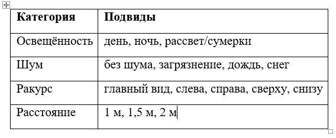

# 6 Введение

Компания ООО «ЛУКОЙЛ-ПЕРМЬ» одна из крупнейших предприятий сегмента «геологоразведка, добыча нефти и газа», является дочерней структурой ПАО «ЛУКОЙЛ». Организация работает в Пермском крае, Ненецком АО, Республиках Башкортостан, Удмуртия и Коми и занимается геологическим изучением, разведкой, поиском и добычей углеводородного сырья, реализацией нефти, газа, продукции газопереработки, а также транспортировкой нефти и газа [1].

## Постановка проблемы

<!-- Найти требования ТГУ к написанию магистерской работы и привести к данным требованиям -->
<!-- Артем предлагает начать описывать проблему с производства. Например, что для контроля за производственными параметрами для предотвращения аварийности и выполнения НТД производится контроль устьевых давлений и автоматизация данного процесса поможет избежать ряд проблем, а подкрепить данную проблему тем что на законодательном уровне это также регламентируется – надо обдумать! -->

При эксплуатации месторождений углеводородного сырья на всех добывающих и нагнетательных скважинах установлены приборы (устройства) для измерения давления на устье скважин. Они предназначены для наблюдения за параметрами эксплуатации скважин, для предупреждения аварийных ситуаций и снижение рисков негативного воздействия на окружающую среду [3][4]. Регулярный контроль и качество переданных значений с данных приборов служит для оценки эффективности мероприятий и для регулирования процесса разработки месторождений [3]. Деятельность российских компаний, занимающихся разработкой и эксплуатацией месторождений углеводородного сырья, регулируется рядом нормативных документов, утверждённых государственными органами власти [2].Контроль и периодичность наблюдений за устьевыми давлениями устанавливается на основании методических указаний [4], технических проектов [3] и внутренних регламентов компаний [5][6][7]. В регламенте по контролю за разработкой месторождений промыслово-геофизическими, гидродинамическими и специальными методами исследований перечислены параметры в промыслово-технологических исследованиях скважин, которые подлежат измерению и контролю (приложение 1) из которых следует, что на фонтанирующих скважинах, добывающих скважинах механизированного фонда и нагнетательных скважинах подлежат контролю буферное, затрубное, межколонное и линейное устьевые давления. Периодчность измерений буферного, затрубного и линейного давлений в добывающих фонтанных и нагнетательных скважинах проводятся с частотой не менее 2 раз в неделю; в скважинах механизированного фонда, оборудованных УЭЦН и УШГН — не менее 1 раза в месяц и, дополнительно при смене режима работы скважины. На скважинах, оборудованных средствами телемеханики, измерения устьевых давлений ведётся непрерывно. Каждому дискретному измерению на установившемся технологическом режиме работы скважины должна предшествовать выдержка скважины на данном режиме не менее 30–60 минут. При переходе с режима на режим измерения проводятся только после стабилизации параметров нового режима. Время стабилизации устанавливается экспериментально.При нестабильной работе скважины необходим долговременный непрерывный мониторинг параметров её работы [8]. Согласно технологических регламентов по эксплуатации насосного оборудования оператор по добыче нефти и газа (далее оператор ДНГ) ведет мониторинг за глубинно-насосным оборудованием, за техническим состоянием и параметрами работы скважин, в том числе за устьевыми давлениями, с периодичностью не менее 1 раза в сутки [9][10][11]. Таким образом, оператор ДНГ на всем механизированном фонде добывающих скважинах контролирует устьевые давления с периодичностью не менее 1 раза в сутки. На скважинах, оборудованных УШГН, устьевые давления представлены 3мя параметрами: линейное, затрубное и межколонное (при наличии) давления (приложение 1). На скважинах, оборудованных УЭЦН и УЭВН, устьевые давления  представляют 4 параметра: буферное, линейное, затрубное и межколонное (при наличии) давления (приложение 1), [9][10][11]. Для фиксации устьевых давлений оператор ДНГ использует смартфон с мобильным приложением, куда руками заносит каждое значение параметра.
<!-- В данном приложении параметры регистрируются, отображаются и передаются в единую централизованную базу данных [12].  -->

<!-- возможно добавить регламент ПАДУ и ТК. Проверить регламент МПО на периодичность и тип параметров-->

В качестве приборов и устройств используются аналоговые манометры и датчики давления. Однако, в силу различных причин (технических и экономических) в целом используются только манометры или совместно датчик давления и манометр для визуализации показаний. При этом считывание показаний с манометров осуществляется оператором только визуально и данные заносятся вручную в мобильное приложение, а количество таких операций может достигать ввода 150 и более единиц информации за смену. В ряде случаев, из-за человеческого фактора, данные могут быть считаны некорректно или занесены с ошибками, что приводит к неверной оценке эффективности мероприятий и может вызвать аварийные ситуации. В связи с этим возникает необходимость в создании системы, способной детектировать избыточное давление на устье скважин с использованием доступных и подручных средств, таких как видеокамера смартфона.

согласно методическим указаниям исследование (замер, прим. автора) буферного и затрубного устьевых давлений должны проводиться не менее 1 раза в месяц [4]. 

## Формулировка цели и задач исследования

**Цель - сократить человеко-часы затраченные на детекцию давления по аналоговому манометру более чем в 3 раза с повышением качества детекции ручного ввода;**  
<!-- Задачи расписать конкретнее (например, разработать архитектуру приложения, графический интерфейс и тп), убрать и не использовать слова, которые показывают сравнительную степень (приемлемое, лучшее и тп) -->
**Задачи:**
* определить подходы к оценке качества и минимальные значения метрик приемлемых для цели проекта; 
* сформировать релевантный датасет; получить модель с приемлемыми метриками качества и размером для среднестатистического смартфона – переформулировать последний тезис; 
* исследовать влияние дефицита и избыточности непрерывной цифровой информации с датчиков (давлений?), установленных на устье скважин, на технологический режимам эксплуатации скважины и на процесс контроля разработки месторождений – эту задачу буду решать в последнюю очередь, если успею.

<!-- Описывать все процессы, которые я делаю сам над проектом. Например, как собирался датасет (ДС), материалы и данные, анализ и выводы -->

**В чем идея**
<!-- Сформировать размеченный ДС (200-300 изображений) с реальными фото/видео с разных ракурсов, при различном освещении, расстоянии и загрязнении, главное, чтоб по кадру визуально читалось (не догадывалось) значение давления. Данный ДС можно будет использовать для теста готовых моделей и своей модели (для сравнения метрик). 

Рассчет количества комбинаций и итоговое количество изображений для целевого датасета: 4 диапазона шкал (1, 2.5, 4, 10 МПа); 3 вида освещенности (день, ночь, рассвет/сумерки); 4 вида шума (без шума, загрязнение, дождь и снег); 5 ракурсов (главный вид – под углом 90° к поверхности и слева, справа, сверху, снизу – под углом 45°); каждый ракурс с 3х расстояний до манометра (0,5м, 1м, 1,5м).

Для охвата более вероятных случаев фиксации показания манометра получаем 180 комбинаций на один шаг стрелки в одном диапазоне шкалы. Если принять за шаг стрелки 1/100 диапазона шкалы (точность измерений до второго знака после запятой) и учесть охват кадрами основные диапазоны для нефтяных скважин (1, 2.5, 4, 10 МПа), то целевой датасет должен содержать 72000 изображений (180*100*4 = 72000). -->

<!-- Для вычисления целевой метрики качества (или ошибки/человеческого фактора ЧФ) необходимо собрать 100-200 случайных записей с показаниями в КИС КПМ (от оператора) и с показаниями на данное время (как в КИС КПМ) из АСУ ТП с датчиков давления. Вычислить ошибку/ЧФ и визуализировать это на графике двумя линиями или каким-то еще образом – подумать. Далее можно собрать с этих скважин видео манометров, прогнать их через разработанную модель и сравнить. -->

На данный момент в компании контроль за устьевыми давлениями осуществляется при помощи манометров и устьевых датчиков давления. Стоит отметить, что устьевой датчик давления устанавливается параллельно с манометром для возможности визуального контроля давления оператором по добыче нефти и газа (далее оператор) и обслуживающим персоналом.

Контроль устьевых давлений на каждой скважине осуществляется с периодичностью отодного до двух раза в сутки. По ряду задач оператор осуществляет ежесменный обход в среднем 50-и скважин, у каждой скважины оператором в том числе заносятся в мобильное приложение (КИС КПМ) смартфона от 2х до 3х значений устьевых давлений [6]. Из презентации: ежесменно оператор ДНГ заносит более 10 параметров работы в среднем по 50 скважинам, а это свыше 500 операций/единиц данных, что приводит к ошибкам или неактуальным значениям при рутинном занесении ввиду человеческого фактора. При этом более 30 % данных это показания с манометров (диаграмма). Более 20 минут каждую смену уходит только на фиксацию устьевых давлений (25 сек * 50 скв = 20,8 мин).

Основная суть идеи заключается в альтернативном способе ввода значений устьевых давлений ручному вводу, что позволит сократить человеко-часы затраченные на данную операцию более чем в 3 раза и повысить качество очень важной исходной информации за счет исключения человеческого фактора. 
Ниже представлена таблица 1 сравнения различных подходов к оцифровыванию первичной информации с устьевыми давлениями.

Таблица 1

Из таблицы наблюдаем, что фото/видеодетекция по большинству критериев имеет преимущества перед другими подходами. Так же рассматривался вариант с голосовым вводом информации, но как видим, что в целом он уступает по одному из ключевых критериев (отсутствие влияния оператора на точность), то есть оператор может ошибочно идентифицировать значение давления или и вовсе продиктовать значение давления без идентификации. И русская народная поговорка, как нельзя, точно описывает выбор в пользу фото/видеодетекции – «Лучше один раз увидеть, чем сто раз услышать!».  

Подход в применении SCADA-систем является самым быстрым и точным способом доставки оцифрованной информации. Но по ряду факторов SCADA-система с датчиками давления не получила достаточного масштабирования за последние 5-10 лет. Для примера, на участке чуть более 500 добывающих скважин SCADA-система с датчиками давления охватывает только 10% скважин и этот охват не меняется с 2020 года. При этом на охваченном данной системой фонде скважин оператор по добыче нефти и газа «вручную» дублирует в КИС КПМ информацию по устьевым давлениям [6].

Развитие идеи в данном подходе в получении цифровой информации для передачи на верхний уровень при различных сценариях (например, наличие видеонаблюдения за оборудованием при отсутствии SCADA-систем, роботизированный/беспилотный контроль за оборудованием, исключительный контроль только обслуживающим персоналом) может открыть дополнительные возможности для оптимизации технологических процессов. 

Стоит отметить, что данный проект, в том числе, нацелен исследовать влияние дефицита и избыточности непрерывной цифровой информации, полученной от скважин, на процесс контроля, создать размеченный датасет от 4х тыс изображений с манометрами при различных условиях.

Собранный датасет восполнит в открытом ИТ сообществе пробел в данном направлении и создаст, возможно, направление для дальнейшего развития в области детекции различных типов манометров и компьютерного зрения в целом.

