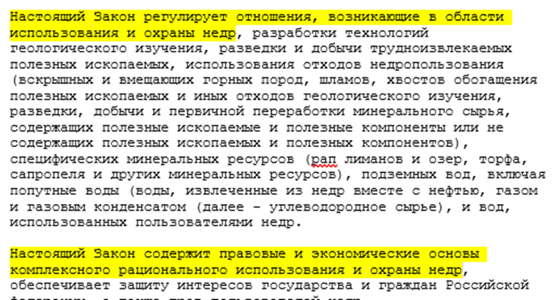
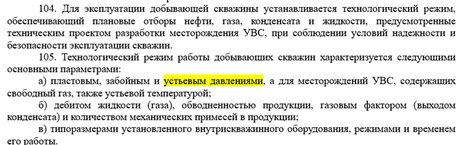
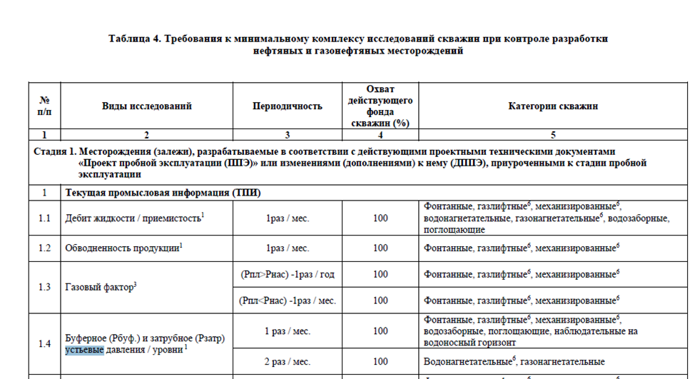
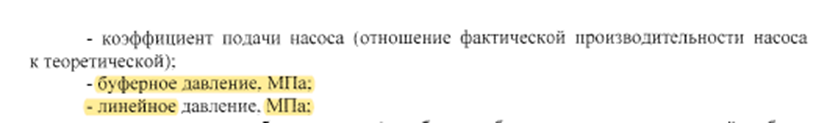
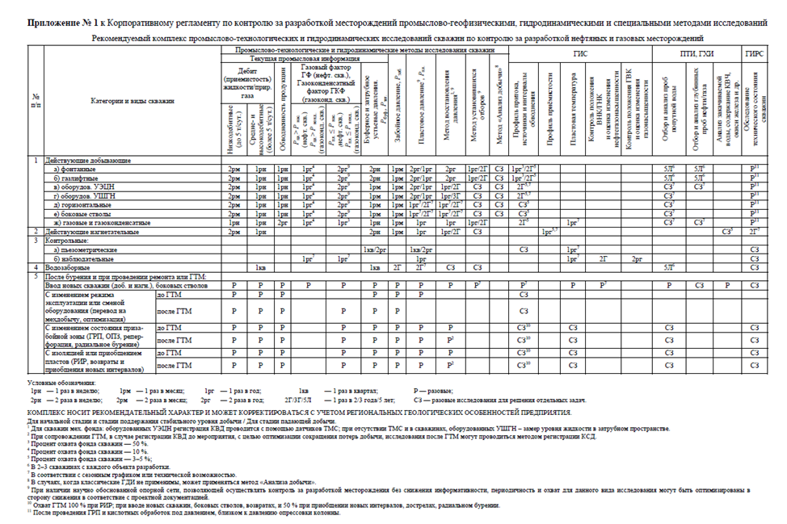

# Черновик

## Для изучения и применения:
Для оформления списка литературы российские издания преимущественно
используют государственные стандарты на библиографическое описание (ГОСТ 7.1–2003;
ГОСТ Р 7.0.5–2008; ГОСТ 7.82–2001). Однако многие отечественные журналы переходят
на международные стандарты, что не является нарушением, так как ГОСТы носят
рекомендательный характер.
Международный стандарт стиля цитирования в области Электроника и информатика - 
IEEE (Institute of Electrical and Electronics Engineers, Inc) Style.

**Выдержки из литературы:**  
2. Закон РФ от 21.02.1992 №2395-1 «О недрах» (редакция от 31.07.2025)

3.	Приказ Министерства природных ресурсов и экологии Российской Федерации и Федерального агентства по недропользованию от 17 марта 2025 г. N 110/02 "Об утверждении Правил разработки месторождений углеводородного сырья".  

21 Часть 1 статьи 26.8 Кодекса Российской Федерации об административных нарушениях.  
22 Раздел XXXVI федеральных норм и правил в нефтяной и газовой промышленности.

4.	Методические указания по комплексированию и этапности выполнения геофизических, гидродинмаических и физико-химических исследований при разработке нефтяных и газовых месторождений. Утверждены и введены в действие с 01.10.2023 г. Протоколом НТС Федерального агентства по недропользованию (ФАН Роснедра) от 05.10.2023 г. № 03-17/8-пр**  
4.1 	Методические указания по комплексированию и этапности выполнения геофизических, гидродинмаических и физико-химических исследований при разработке нефтяных и газовых месторождений. Утверждены и введены в действие с 01.10.2023 г. Протоколом НТС Федерального агентства по недропользованию (ФАН Роснедра) от 05.10.2023 г. № 03-17/8-пр**  

**Литература для дальнейшего изучения:**  
Регламент по формированию технологических режимов добывающих скважин ООО «ЛУКОЙЛ-ПЕРМЬ», приказ а-470 от 31.07.2023 года

РЕГЛАМЕНТ ПО КОНТРОЛЮ ЗА РАЗРАБОТКОЙ
МЕСТОРОЖДЕНИЙ ПРОМЫСЛОВО-
ГЕОФИЗИЧЕСКИМИ, ГИДРОДИНАМИЧЕСКИМИ
И СПЕЦИАЛЬНЫМИ МЕТОДАМИ ИССЛЕДОВАНИЙ, Москва 2021

Промыслово-технологические исследования скважин (ПТИ) — опера-
тивные текущие измерения технологических параметров скважин на устье
и фиксированной отметке в стволе скважины: буферного и затрубного устьевых
давлений, динамических и статических забойных давлений, дебитов нефти
и газа, конденсата и воды по НКТ и затрубному пространству, температуры,
уровней раздела фаз в стволе скважины.

3.4 Методика проведения и обработки результатов ПТИ  
3.4.1 Определение устьевых давлений  
3.4.1.1 Давления на устье (буферное, затрубное, межколонное), а также
устьевые температуры определяются путём непосредственных измерений с по-
мощью стандартных стационарных или мобильных датчиков. Эти измерения
позволяют судить о текущем режиме работы скважины, а также используются
для приближенной экспресс-оценки давления на забое скважин.
На нагнетательных скважинах помимо величины буферного давления
(после штуцера) контролируется давление в линии закачки (до штуцера).  
3.4.1.2. Замеры буферного, затрубного и линейного давлений в добываю-
щих фонтанных и нагнетательных скважинах проводятся с частотой не менее
2 раз в неделю; в скважинах механизированного фонда, оборудованных УЭЦН
и УШГН — не менее 1 раза в месяц и, дополнительно при смене режима работы
скважины. На скважинах, оборудованных средствами телемеханики, измерения
устьевых давлений ведётся непрерывно.  
3.4.1.3. Дополнительные замеры устьевых давлений проводятся синхрон-
но с другими видами ПТИ (при контроле уровня жидкости в межтрубье добы-
вающих скважин), а также при проведении ПГИ.  
3.4.1.4. Каждому дискретному измерению на установившемся технологи-
ческом режиме работы скважины должна предшествовать выдержка скважины
на данном режиме не менее 30–60 минут. При переходе с режима на режим из-
мерения проводятся только после стабилизации параметров нового режима.
Время стабилизации устанавливается экспериментально. При нестабильной ра-
боте скважины необходим долговременный непрерывный мониторинг парамет-
ров её работы.  
3.11. Средства измерения ПТИ и ГДИС  
3.11.1. При проведении промыслово-технологических и гидродинамиче-
ских исследований для регистрации забойных давлений должны использоваться
электронные автономные или дистанционные приборы, для регистрации усть-
евых давлений могут использоваться электронные и механические приборы.
Электронные приборы должны подключаться к персональному компьютеру для
считывания информации или отображения регистрируемых данных в реальном
времени.  
3.11.2. Технические средства измерения ПТИ и ГДИС должны быть атте-
стованы (сертифицированы) органами надзора РФ.  
3.11.3. Скважинные автономные и дистанционные устьевые и глубинные
приборы для измерения давления и температуры (манометры-термометры),
приборы для контроля уровня жидкости в скважине периодически, в соответст-
вии с паспортными данными, должны проходить поверку центрами метрологии.
По результатам поверки выполняется тарировка измерительных приборов в за-
данном диапазоне давлений и температуры.  
3.11.6. С целью контроля устьевых давлений и температуры могут ис-
пользоваться автономные («МИКОН-207», «ФОТОН-У», «УМТ-01», «Литан»,
«Автон» и др.) и образцовые манометры с классом точности 0.4  
6.5.4.3. Контроль за энергетическим состоянием объекта разработки
и гидродинамических параметров пласта производится промыслово-технологи-
ческими и гидродинамическими методами исследования скважин путём изме-
рения пластового, забойного давления, давлений на устье и затрубье добываю-
щих и нагнетательных скважин, статических и динамических давлений на
приёме насосов оборудованных датчиками ТМС, статических и динамических
уровней, снятия кривых восстановления (падения) давления (уровня), исследо-
вания скважин методом установившихся отборов и гидропрослушивания.  
6.5.4. Контроль энергетического состояния и гидродинамических
параметров пласта  
6.5.4.1. Контроль за энергетическим состоянием объекта разработки
и гидродинамическими параметрами пласта производится для изучения дина-
мики изменения пластового и забойного давления в зонах отбора, закачки и бу-
рения, коэффициентов продуктивности и приемистости скважин, гидропровод-
ности, пьезопроводности пласта в районе действующих скважин с целью полу-
чения информации, необходимой для регулирования процесса разработки.  
6.5.4.12. Замеры устьевых давлений в добывающих фонтанных и нагнета-
тельных скважинах проводятся с частотой не менее 2-х раз в неделю; в скважи-
нах механизированного фонда, оборудованных УЭЦН и УШГН — не менее
1 раза в квартал. На скважинах, оборудованных средствами телемеханики, из-
мерения устьевых давлений ведётся непрерывно.  

МЕТОДИЧЕСКИЕ УКАЗАНИЯ
ПО ПРОВЕДЕНИЮ ПРОМЫСЛОВЫХ ИССЛЕДОВАНИЙ  СКВАЖИН
МУ-07-001-07  
5.2.	ИССЛЕДОВАНИЯ НЕФТЯНЫХ СКВАЖИН  
5.2.1.	При промысловых исследованиях нефтяных скважин показатели определяются следующим образом:  
5.2.30.	Замеры буферного, линейного и  затрубного (межтрубного) давлений на скважинах, на которых данные показатели не регистрируются автоматически, проводятся не реже 1 раза в 3 дня. Замеры выполняются операторами ЦДНГ по показаниям скважинных манометров, соответствующих ГОСТ 15807.  При выводе скважин механизированного фонда  на режим после ТКРС замеры Рбуф, Рзат, Рл  выполняются при замерах динамического уровня.

ТЕХНОЛОГИЧЕСКИЙ РЕГЛАМЕНТ эксплуатации установок электроцентробежных насосов

13. Мониторинг технического состояния скважин, контроль за эксплуатацией УЭЦН.
(Выполняется КПР.ЛУКП.25(1).01.00592 Контроль за эксплуатацией ГНО).
Контроль за исправностью и работоспособностью наземного и подземного оборудования УЭЦН ведется оператором по ДНГ при обходе, объезде фонда скважин не менее 1 раза в сутки.

ТЕХНОЛОГИЧЕСКИЙ РЕГЛАМЕНТ эксплуатации УШГН?

