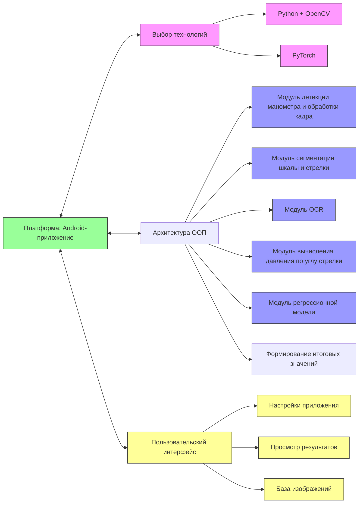

```mermaid
graph LR
    %% Платформа
    A[Платформа: Android-приложение] <--> B[Выбор технологий]
    
    %% Технологии
    B --> C[Python + OpenCV]
    B --> D[PyTorch]
    
    
    %% ООП-модули
    A <--> F[Архитектура ООП]
    F --> G[Модуль детекции манометра и обработки кадра]
    F --> H[Модуль сегментации шкалы и стрелки]
    F --> I[Модуль OCR]
    F --> J[Модуль вычисления давления по углу стрелки]    
    F --> K[Модуль регрессионной модели]
    
    %% Конвейер обработки
    
    F --> K1[Формирование итоговых значений]
    
    %% Доп.элементы
    A <--> L[Пользовательский интерфейс]
    L --> M[Настройки приложения]
    L --> N[Просмотр результатов]
    L --> O[База изображений]
    
    %% Стили
    classDef platform fill:#9f9,stroke:#333;
    classDef tech fill:#f9f,stroke:#333;
    classDef module fill:#99f,stroke:#333;
    classDef ui fill:#ff9,stroke:#333;
    
    class A platform;
    class B,C,D,E tech;
    class G,H,I,J,K module;
    class L,M,N,O ui;
```