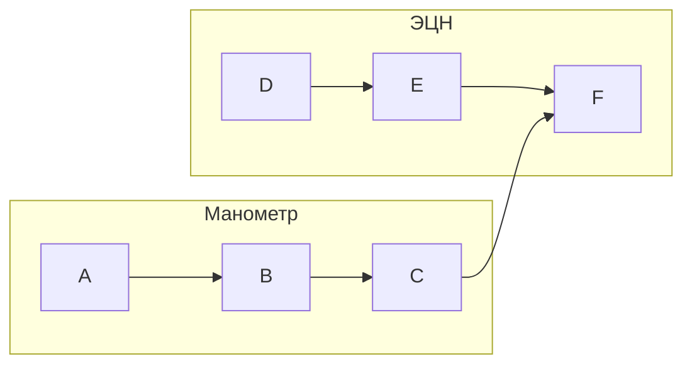
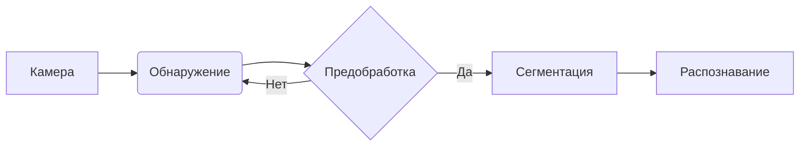
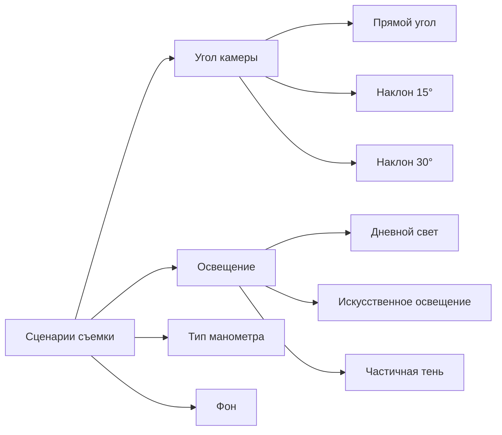

``` mermaid
graph TD
  subgraph Манометр
    A[Камера МПО] --> B[Детекция прибора]
    B --> C[Сегментация стрелки]
    C --> D[Интерпретация давления]
  end
  subgraph ЭЦН
    E[Камера МПО] --> F[Экран]
    F --> G[OCR]
  end
  D --> H[МПО] 
  G --> H
  ```
```mermaid
graph LR
    %% Платформа
    A[Платформа: Android-приложение] --> B[Выбор технологий]
    
    %% Технологии
    B --> C[Python + OpenCV]
    B --> D[PyTorch]
    B --> E[Оптимизация для МПО]
    
    %% ООП-модули
    A --> F[Архитектура ООП]
    F --> G[Модуль захвата изображения]
    F --> H[Модуль обработки манометра]
    F --> I[Модуль обработки ЭЦН]
    F --> J[Модуль передачи данных]
    
    %% Конвейер обработки
    
    F --> K[Формирование итоговых значений]
    
    %% Доп.элементы
    A --> L[Пользовательский интерфейс]
    L --> M[Настройки камеры]
    L --> N[Просмотр результатов]
    L --> O[Ручная проверка]
    
    %% Стили
    classDef platform fill:#9f9,stroke:#333;
    classDef tech fill:#f9f,stroke:#333;
    classDef module fill:#99f,stroke:#333;
    classDef ui fill:#ff9,stroke:#333;
    
    class A platform;
    class B,C,D,E tech;
    class G,H,I,J,K module;
    class L,M,N,O ui;
```